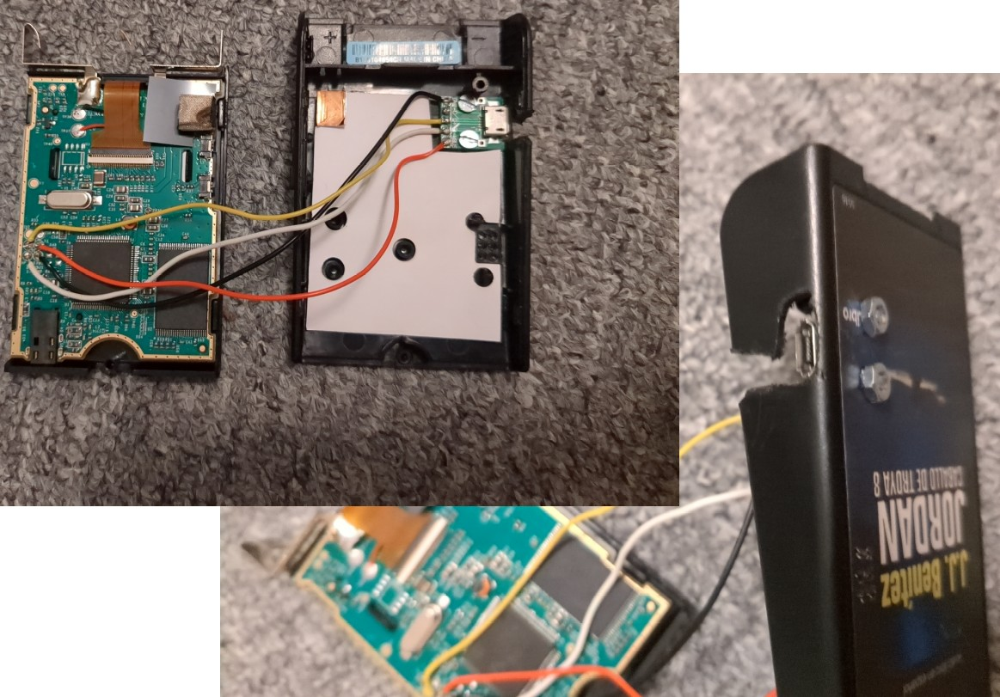
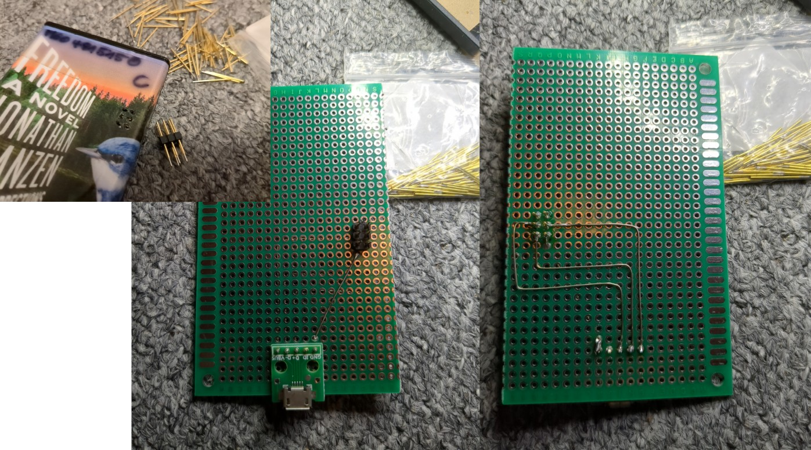

# Play more on Playaway
[Playaways](https://playaway.com/) are small audio players that mostly contain audio books.  
  
  
They can be found in public libraries and are rather expensive compared to other general purpose audio/MP3 players and come in two versions: an older model with a [16 segment display](https://en.wikipedia.org/wiki/Sixteen-segment_display) and a newer version with graphics display and backlight.  
Still though they concentrate on the basics and doing these basics well. It seems they follow one of the Unix philosophy cornerstone to [do one thing and do that well](https://en.wikipedia.org/wiki/Unix_philosophy). The devices have huge physical buttons, a display (that is not really needed), a standard 3.5mm headphone jack, remember exactly the listening position and run for 20+hrs on a standard AAA battery. You take the device with you like a normal book and just start listening. No smartphone or other device features that could distract you from just diving in to the story the author wants to present to you.  
The devices can be bought with one single audio book on them and no (official) way of changing this. If bought new they [start at](https://shop.playaway.com/playaway) approx. 40€ (October 2023) depending on the audio book stored on them. Playaway only wants organizational customers (e.g. libraries) so individuals need to checkout the second hand market.  
  
This repository shows an unofficial way to make more use of the Playaway hardware by allowing to put other audio books on them and therefore also avoiding e-waste. This usually requires opening the device and soldering wires on the printed circuit board as well as installing and running the software in this repository. All your might be existing warranty is then lost.  
This repository also acts as a kind of history of these interesting devices (see Model overview chapter below).  
  
There are different hardware and software versions of the Playaways. Even if they look identical from the outside they might be different. I have checked a few Playaways now but the software and descriptions of this repository might not work for your model. I am interested in learning more about the other models. Please use the [forum](https://github.com/lanmarc77/playaway/issues) to contact me.  
  
All my findings for my model(s) are built on the great prework of:  
[Teardown video with different models](https://www.youtube.com/watch?v=CapoZ9ZmoAM)  
[Teardown article with high res pictures](https://www.mitsake.net/2019/06/playaway-audiobook-teardown/)  
  
Their research led me to buying my first second hand as it seemed to me that the most important part of actually storing another audio book on it was just a little additional step. As it turned out...it was.  

# The hardware
I bought my first Playaway as a surprise offer for 8,94€. This device is now not thrown away but I could learn with it and by reading the following chapters you will too. (I accidentally broke the display in the meantime :-(  but it still plays audio.)  
  
  
I got a very used model with a leaked battery in the case. I replaced the battery switched it on and it worked.  
[If you can not open it you don't own it.](https://valpo.life/article/if-you-cant-open-it-you-dont-own-it/) I opened it up to solder a USB cable as described by the prework mentioned earlier:  
  
  
This first model has an 128MiB flash chip (105MiB usable). There are other hardware models with 256MiB or even 512MiB.  
With my first modification I cut a hole in the case and used hot glue to mechanically fix the cable and were ready to go for further research:  
  

  
A more flexible and long term approach was to actually add a micro USB connector:  

and also for one of my segment models:  

  
And as I got more and more devices a pogo clip adapter got useful. With this adapter I only need to make holes in the back cover to read and rewrite the Playaway:  

  
# File system structure
  
Once connected I was greeted with the following file system layout:  
  
  
The flash has the following partition table:  
  
  
We can use 105MiB for audio files (for 256MiB flash versions 230MiB/for 512MiB flash versions 461MiB). The missing few MiBytes are used for the firmware (as to much is missing just because of the file system overhead). The SOC can boot firmware from an attached flash memory.  
My main goal was to put other audio books on it.  
  
On one of my segment models the file structure looked like this:  
  
The file naming is slightly different. The reason is that the audio book from this segment Playaway has not only chapters but also subchapters. The segment display showed: 1*1, 2*1, 2*2, 2*3, 3*1 ... while also displaying the very first file in the list on the display as Intro.  
  
After testing a lot with what files can be deleted it turned out only the .awb files and the PATWEAKS.DAT are needed for the SOC firmware to work correctly.  
The other files store the current listening position and also seem to keep track of the validity of files via CRC method (CMI_CRC.DAT). It is a bare flash chip, so the SOC firmware must keep track of errors that usually is being dealt with via wear leveling if using an SSD within their firmware.  
It is important to note that all theses additional files **must be deleted** if new audio files and a new PATWEAKS.DAT are put on the Playaway. Otherwise the information stored
in these other files do not match the actual audio book files anymore. The firmware will recreate the missing files fitting to the new audio book files.
  

### Creating .AWB files
The format used is [AMR-WB+](https://en.wikipedia.org/wiki/Extended_Adaptive_Multi-Rate_%E2%80%93_Wideband). This is a documented
codec but not implemented in any well used open source software. Ffmpeg as a very long standing [feature request](https://trac.ffmpeg.org/ticket/6140).  
It is possible to get the freely available (windows only) decoder and encoder from [here at 3GPP](https://portal.3gpp.org/desktopmodules/Specifications/SpecificationDetails.aspx?specificationId=1451).  
Only the files encoder.exe and er-libisomedia.dll are needed to encode new AMR-WB+. The encoder.exe runs without any problems using wine. Faster is the Linux port from Dhiru Kohlia (see how to get it below).  
The encoder needs a specific .wav format as input file.  
I experimented a bit and was successful with generating a .wav file from e.g. an MP3 using ffmpeg with the following command line.  
`
ffmpeg -i input.mp3 -f wav -c:a pcm_s16le -ar 44100 -empty_hdlr_name 1 -fflags +bitexact -flags:v +bitexact -flags:a +bitexact -map_metadata -1 input_as_wav.wav
`  
This command line and the parameters assure that there is no metadata in the .wav file as the encoder will otherwise not be able to open the .wav. It took me a while to figure that out.  
  
The generated .wav can now be encoded into an AMR-WB+ file with the following command using an installed wine and the encoder.exe which needs the er-libisomedia.dll in the same directory:  
`
wine encoder.exe -rate 10 -mono -ff raw -if input_as_wav.wav -of "0001 BookName 0000.awb"
`  
  
or with the approx. 34% faster Linux binary:  
`
./encoder-new -rate 10 -mono -ff raw -if input_as_wav.wav -of "0001 BookName 0000.awb"
`  
#### On bitrates, storage and runtime
I figured out that the lowest bitrate parameter (-rate) for my Playaway is 10. Anything lower resulted in stuttering playback.
The highest tested bitrate is 36kbit/s. The original files on my Playaway were encoded with 36kbit/s.
Most likely AMR-WB+ mode index 23 with ISF index 13, the best possible mono rate resulting in approx. 6.5hrs playtime.
10kbit/s still sounds good enough for me and as there only are 105MiB on my first model we want to test the lower boundaries. With 105MiB and 10kbit/s we can store approx. 23hrs. on the Playaway.  
I was not able to get stereo to play on the Playaway. It did encode everything but the player did not play the file but jumped directly to the next chapter/track.  
I also tested AMR-NB and AMR-WB files but they did not play.  
  
#### File naming conventions
I stayed with the file naming convention I found and did not test any other versions.
The first 4 digit number is the chapter while the last 4 digit number is always 0000. I assume the last 4 digit number comes
in use when multiple audio books are placed on one Playaway.  
  
The file names of my first segment model looked slightly different (see above).  
The first 6 digits of the name are split in groups of three with the first group being the main chapter and the
second group being the subchapter in that chapter.
The last 4 0000 digits are still unclear what they mean.  
The very first file only contains 0s in its digits and is displayed as Intro on the Playaway.  
This naming convention and type of display only activates if subchapter mode is enabled in the PATWEAKS.DAT (see chapter below). Otherwise the Playaway just displays normally counting up chapters.  
  
### Generating PATWEAKS.DAT
The .awb files are of no use if there are not referenced correctly in the PATWEAKS.DAT. When placing a new PATWEAKS.DAT and new .awb files on the Playaway it is important to delete ALL other files from the Playaway.  
A minimal PATWEAKS.DAT that I tested and works for the segment and graphics models looks like this:  
  
`
NMD003
`
  
This example assumes 3 .awb files as the digits in `NMD003` specify the number of .awb files.  
You need to adjust this value to match to number of .awb files exactly.  
The line is finished with a windows line break (\r\n).  
  
#### Inside the PATWEAKS.DAT
Solving this is the main puzzling work. The original I found on my first Playaway looked like this:  
`
AWBVOL082002SLD090080PUP003NMD003BLN020BLP020ELA00003B07D0BECOP5521~ 2007 FonoLibro Inc.00000019^ 2006 J.J. Bentez,222006 Editorial Planeta0000
`  
A (more or less) human readable file in plain ASCII with an ending windows line break. Comparing this string with the one from the video (see prework links above) showed the similarities and differences. A lot of debugging and testing later the following can be documented:  
  
All currently analyzed PATWEAKS.DAT start with `AWBVOL` so it is assumed this is kind of a starting header. 
Then different flags (capital letters) followed by parameters (mostly numbers) are following.  
The following table lists all known flags and where known describes it's purpose. Not all flags might work on all models or firmware versions.  
  
| flag example | description |
|--------------|------------|
|AWBVOL082002|most likely header with version information or two tags AWB for the format and VOL for volume preset level|
|SLD090080|?|
|PUP003|?|
|AF*|switches to subchapter mode if the file naming is also correct|
|TRK|displays the word "Track"/"TR" instead of "Chapter"/"CH" when skipping|
|NMD003|sets the number of .awb files for this audio book, this is the only required flag|
|BLN020|?, but only is present if COP is present|
|BLP020|?, but only is present if COP is present|
|ELA00003B07D0BE|determines the relation of chapter and length of the progress bar on a graphics model|
|COP5521~ 2007 FonoLibro Inc.00000019^ 2006 J.J. Bentez,222006 Editorial Planeta0000|displays copyright information during start of the first track, internal structure still unclear|
|EQU|? most likely an equalizer preset|
|MUS|?|
|OBS|?|
|SPB|?|

##### Details to ELA
This took the longest to figure out and it's still not perfect but good enough (ELA=Estimated Length Audio?). The numbers are groups by hex digits of three:  
`000 03B 07D 0BE`  
Each group represents one chapter(=.awb file) and the length of the progress meter which is displayed. Additionally a first entry which is (most likely) always 000.  
Here on the first chapter the length 000 is given which means an almost not visible progress meter if this chapter is selected. Chapter 2 raises the progress to 03B. This number actually represents the time length of the first chapter. The value is determined by the length of the first chapter in minutes. For my Playaway the three different chapters had the length of 64,70 and 70 minutes.  
  
Time difference: 000-03B = 59minutes  
Time difference: 03B-07D = 66minutes  
Time difference: 07D-0BE = 65minutes  
  
We can see that the ELA calculated times do not match 100%. It is unclear why the numbers do not match better.
I tested different files which are smaller/shorter so that the progress meter also changes faster and it worked
good enough. Also a 1pixel difference because of a slightly off value is hardly noticeable once the audio book
is longer than one hour.  
If this flag is left out the progress meter display the length of the currently played chapter and not based
from the length of the whole audio book.  
  
##### Details to AF*
If this flag is present the Playaway does not only show the chapter it plays and the amount of chapters
(on the graphics model) but can also display subchapters. The graphics model shows e.g. 2-1 56
(chapter 2, subchapter 1 of 56 in total, [example](pics/playaway_differentDisplay.jpg)). For this mode
the files need to be named with 6 digits format (see above) AND the PATWEAKS.DAT needs to contain the AF* flag.  
  
##### Details to COP
It is unclear what exactly COP5521 means (COP=COPyright?). But the following string is shown when the Playaway
starts playing the first chapter of an audio book for a few seconds until the play time is displayed.
It has an internal structure which seems to determine the position on the display and the time it is displayed.  
Setting it to COP0000 or leaving it out does not display anything.  
  
# Key combos
  
- when in paused mode SPD+REWIND allows to reset all settings, one needs to press PLAY to accept
- segment model: when in play mode SPD+REWIND locks the keys, unlock again with the same combo
- graphics model: when in paused mode pressing both track skip buttons at the same time shows information of the firmware ([example picture](pics/fw_graphics_model.jpg))  
  The Chip version most likely refers to specific sub version of the used STMP3770 main processor as they are models marked STMP3770 A3 and A2 while TA might stand for Taiwan.  
- segment model: when in play mode SPD+EQ shows version information of the firmware and player usage ([example picture](pics/fw_segment_model.jpg))  
  Possible explanations: USAGE=intro text, REV74=main revision, U0026: sum of power ups and power downs (seems to be only even numbers),
  E0000=elapsed time in minutes of the Playway since power up, 1*28V=current battery level, SU111=???? (also seen SU101), 70TA3=main processor model  
  

# The Perl script
The script assumes it can write to the current directory and only works with Linux. It assumes `ffmpeg`, `ffprobe` and `mktemp` are callable. No additional Perl modules are needed.  
It expects all audio files to be converted within the same directory where it is placed.  
It will create a local directory based on the book name you choose and places all converted files there to copy on your Playaway. All existing files of the Playaway can be deleted or backed up if you need them later.  
The script tries to detect all errors so as long as no "ERROR: ..." message appears everything is ok. The script does not hide all the output of the called commands and is therefore a bit talkative.  
The chapter order is determined by a simple Perl sort which sorts based on ASCII position.  
  
The script asks the following questions:  
bookname: a name of the book which essentially is the folder name where the encoded files for the Playaway will be stored  
bitrate: select the bitrate used to encode the audiobook, higher bitrates mean better quality but more space, you can also insert e.g. a1 to automatically determine the best bitrate based on the flash space your Playaway has, a1 stands for 1Gbit, a2 for 2Gbit and a4 for 4Gbit Playaways  
splitmode: the script splits each file in chunks of the selected minutes, this is useful if you have on big file but want to create chapters e.g. every 30min  
classic or light?: if you choose light the progress meter of the Playaway light will reflect the length of the complete audiobook, otherwise the length of the currently selected chapter  
  

## AMR-WB+ encoder
Finally the AMR-WB+ encoder binary `encoder-new` is also needed in the current directory.  
This binary can be compiled from [this original repository](https://github.com/kholia/amr-wbp-plus) (Thank you Dhiru Kohlia!) or directly downloaded as [statically compiled Linux binaries from my fork repository](https://github.com/lanmarc77/amr-wbp-plus/releases).  
  
# Other findings

- The Playaway graphics model switches off after 8hrs of continuous playback independent of the battery level  
- The Playaway segment model switches off after 6hrs of continuous playback independent of the battery level  
- The PCB solder spot marked as PWR (top right) is actually a connection to pin 70/PSWITCH of the STMP3770. If pulled high to 5V with a resistor it boots into USB recovery mode and reports as such a device via USB. It might be possible to read/reflash the firmware via this interface.  
- compatible tested audio jack for refurbishing the segment model: CUI SJ-3523-SMT-TR (https://de.rs-online.com/web/p/klinken-steckerbuchsen/2596685, https://www.digikey.de/de/products/detail/cui-devices/SJ-3523-SMT-TR/281297)
- untested probably compatible audio jack for refurbishing the graphics model: CUI SJ-3501-SMT-TR (https://www.digikey.de/de/products/detail/cui-devices/SJ-3501-SMT-TR/2625165)
- reading some FAQs from libraries it seems there is a shuffle play mode
- the segment model supports very long files of 10hrs but displays a maximum timestamp of 255:59 which then over-/underflows

## Possible firmware bugs
Software is written by humans and we make mistakes. Here are some bugs found when using the Playaways:  
  
- On a graphics model the Playaway does not auto power off when finished. This happens with single a 3hr long track (ocean waves)
  that is played completely. The Playaway stops at the end of this single track but does not auto power off. Adding an additional
  5s track of silence mitigates this bug. After the second track of silence was played the Playaway powers off automatically correctly.  
  Detected on firmware 01:05.
- On a graphics model the Playaway stops playing a single 3hrs long file after 1hrs:28mins and additionally does not power off automatically.  
  Detected on firmware 01:03. Firmware 01:05 plays the very same file completely.  
  

# Model overview
As described there are different models. It is currently unclear how many hardware/software versions exists. At least the models with a segments display exists and those with the graphics display.  
Some graphics models greet you with either "NOW YOU SEE ME" or "BUILT FOR LISTENING" ([here](pics/playaway_differentDisplay2.jpg)).  
The following table shows the models researched already and their characteristics.  
  
Legend:  
  
* model: S=segment model, G=graphics model  
* PCB dates in 4 digit format are most likely year followed by calendar week  
  
  
| book        | runtime   | bitrate  | release date  | model   | flash |  processor | PCB date | firmware | pictures |
|-------------|-----------|----------|---------|-------|------------|----------|------------|------------|------------|
|Six Years by Harlan Coben|10:34:21|?|19.03.2013|S|Hynix H27U1G8F2BTR BC 233AA / 1Gbit|STMP3770 A3 PTX AA1307G TAIW|?|?| [F](pics/models/sixyearsF.jpg),[B](pics/models/sixyearsB.jpg),PF,[PB](pics/models/sixyearsPB.jpg) (by [Quick Look & Teardown](https://www.youtube.com/watch?v=CapoZ9ZmoAM))|
|The Breakdown by B.A. Paris|09:20:14|?|18.07.2017|G|Hynix H27U1G8F2BTR BC 637A / 1Gbit|STMP3770 A3 PTX XAA1B27AE TAIW|1646|?| [F](pics/models/thebreakdownF.jpg),[B](pics/models/thebreakdownB.jpg),[PF](pics/models/thebreakdownPF.jpg),[PB](pics/models/thebreakdownPB.jpg) (by [Quick Look & Teardown](https://www.youtube.com/watch?v=CapoZ9ZmoAM)())|
|Jordan (Caballo de Troya) by J.J. Benitez|02:13:47|36kBit/s|01.09.2009|G|Hynix H27U1G8F2BTR BC 30AA / 1GBit|STMP3770 A3 PTX A1429U TAIW|1447|01:04| [F](pics/models/jordanF.jpg),[B](pics/models/jordanB.jpg),[PF](pics/models/jordanPF.jpg),[PB](pics/models/jordanPB.jpg)|
|Pelican Brief by J. Grisham|11:37:40|36kBit/s|?|S|Hynix HY27UF082G2B TPCB 020AA / 2Gbit|STMP3770 A2 PTX AD1023AV TAIW|2009-11-25|| [F](pics/models/pelicanbriefF.jpg),B,[PF](pics/models/pelicanbriefPF.jpg),[PB](pics/models/pelicanbriefPB.jpg) (by [mitsake.net](https://www.mitsake.net/2019/06/playaway-audiobook-teardown/))|
|Freedom A Novel by Jonathan Franzen|24:09:17|31.2kBit/s|01.05.2012|S|Hynix HY27UF084G2B TPCB 927A / 4Gbit|STMP3770 A2 PTX AE1007AC TAIW|2009-11-19|REV74| [F](pics/models/freedomF.jpg),[B](pics/models/freedomB.jpg),[PF](pics/models/freedomPF.jpg),[PB](pics/models/freedomPB.jpg)|
|French Silk by Sandra Brown|15:50:18|31.2kBit/s|01.09.2010|S|Hynix H27U4G8T2BTR BC 011FA / 4Gbit|STMP3770 A2 PTX AC1018AJ TAIW|2010-05-28|REV74| [F](pics/models/frenchsilkF.jpg),[B](pics/models/frenchsilkB.jpg),[PF](pics/models/frenchsilkPF.jpg),[PB](pics/models/frenchsilkPB.jpg)|
|Hell's Corner by David Baldacci |14:23:11|31.2kBit/s|09.11.2010|S|Hynix HY27UF082G2B TPCB 016F / 2Gbit|STMP3770 A2 PTX AJ1019AP TAIW|2010-05-28|REV63| [F](pics/models/hcornerF.jpg),[B](pics/models/hcornerB.jpg),[PF](pics/models/hcornerPF.jpg),[PB](pics/models/hcornerPB.jpg)|
|Celebrity in Death by J.D. Robb|13:23:06|31.2kBit/s|21.02.2012|S|Hynix H27U2G8F2BTR BC 290AA / 2Gbit|STMP3770 A3 PTX AA1304F TAIW|2011-08-18 / 1224|| [F](pics/models/celebdeathF.jpg),[B](pics/models/celebdeathB.jpg),[PF](pics/models/celebdeathPF.jpg),[PB](pics/models/celebdeathPB.jpg)|
|The Elephant Keeper's Children by Peter Høeg|13:44:20|31.2kBit/s|23.10.2012|S|Hynix HY27UF082G2B TPCB 224F / 2Gbit|STMP3770 A3 PTX AD1208N TAIW|2011-08-18 / 1224|REV74| [F](pics/models/elephantchildrenF.jpg),[B](pics/models/elephantchildrenB.jpg),[PF](pics/models/elephantchildrenPF.jpg),[PB](pics/models/elephantchildrenPB.jpg)|
|The Husband's Secret by Liane Moriarty|13:41:13|31.2kBit/s|01.10.2013|G|Hynix H27U2G8F2CTR BC 321HA / 2Gbit|STMP3770 A3 PTX AA13240 TAIW|1345|01:03| [F](pics/models/husbandsecretF.jpg),[B](pics/models/husbandsecretB.jpg),[PF](pics/models/husbandsecretPF.jpg),[PB](pics/models/husbandsecretPB.jpg)|
|Us Against You by Frederik Backman|14:16:45|31.2kBit/s|05.06.2018|G|MXIC MX30LF2G18AC-TI / 2Gbit|STMP3770 A3 PTX XAA1747G TAIW|1807|| [F](pics/models/usagainstyouF.jpg),[B](pics/models/usagainstyouB.jpg),[PF](pics/models/usagainstyouPF.jpg),[PB](pics/models/usagainstyouPB.jpg)|
|One By One by Ruth Ware|13:08:10|15.6kBit/s|08.09.2020|G|Hynix HU27U1G8F2CTR VC 805A / 1Gbit|STMP3770 A3 PTX XAA1934A TAIW|1947|01:08| [F](pics/models/onebyoneF.jpg),[B](pics/models/onebyoneB.jpg),[PF](pics/models/onebyonePF.jpg),[PB](pics/models/onebyonePB.jpg)|
|Kingdom Keepers: The Return Book Three by Ridley Pearson|10:06:31|20.4kBit/s|01.04.2017|G|Hynix H27U1G8F2BTR BC 637A / 1Gbit|STMP3770 A3 PTX XAA1627AE TAIW|1646|01:05| [F](pics/models/kingdomkF.jpg),[B](pics/models/kingdomkB.jpg),[PF](pics/models/kingdomkPF.jpg),[PB](pics/models/kingdomkPB.jpg)|
|All We Ever Wanted by Emily Griffin|10:29:05|18kBit/s|01.07.2018|G|Toshiba TC58BVG0S3HTA00 / 1Gbit|STMP3770 A3 PTX XAA1833AA TAIW|1837|01:08| [F](pics/models/allweeverwantedF.jpg),[B](pics/models/allweeverwantedB.jpg),[PF](pics/models/allweeverwantedPF.jpg),[PB](pics/models/allweeverwantedPB.jpg)|
|The Perfect Wife by JP Delaney|10:42:02|18kBit/s|06.08.2019|G|MXIC MX30LF1G18AC-TI / 1Gbit|STMP3770 A3 PTX XAA1911AW TAIW|1918|01:08| [F](pics/models/theperfectwifeF.jpg),[B](pics/models/theperfectwifeB.jpg),[PF](pics/models/theperfectwifePF.jpg),[PB](pics/models/theperfectwifePB.jpg)|
|The Song Of The Quarkbeast by Jasper Fforde|07:36:00|20.4kBit/s|11.03.2014|G|Hynix H27U2G8F2CTR BC 348F / 2Gbit|STMP3770 A3 PTX AA1312C TAIW|1347|01:04| [F](pics/models/quarkbeastF.jpg),[B](pics/models/quarkbeastB.jpg),[PF](pics/models/quarkbeastPF.jpg),[PB](pics/models/quarkbeastPB.jpg)|
|Between Love & Honor by Alexandra Lapierre|14:40:27|31.2kBit/s|17.04.2014|S|Hynix HY27UF082G2B TPCB 118F / 2Gbit|STMP3770 A3 PTX AA1146E TAIW|2011-08-18 / 1143|REV74| [F](pics/models/loveandhonorF.jpg),[B](pics/models/loveandhonorB.jpg),[PF](pics/models/loveandhonorPF.jpg),[PB](pics/models/loveandhonorPB.jpg)|
|Rage of The Dragon by Margaret Weis & Tracy Hickman|11:23:45|31.2kBit/s|24.04.2012|S|Hynix HY27UF082G2B TPCB 118F / 2Gbit|STMP3770 A3 PTX AA1147AL TAIW|2011-08-18 / 1143|REV74| [F](pics/models/rageofthedragonF.jpg),[B](pics/models/rageofthedragonB.jpg),[PF](pics/models/rageofthedragonPF.jpg),[PB](pics/models/rageofthedragonPB.jpg)|
|Kiss The Girls And Make The Cry by Mary Higgins Clark|09:52:04|20.4kBit/s|05.11.2019|G|Toshiba TC58BVG0S3HTA00 / 1Gbit|STMP3770 A3 PTX XAC1735D TAIW|1912|01:08| [F](pics/models/kissthegirlsF.jpg),[B](pics/models/kissthegirlsB.jpg),[PF](pics/models/kissthegirlsPF.jpg),[PB](pics/models/kissthegirlsPB.jpg)|
|Thirteen Reasons Why by Jay Asher|06:35:45|31.2kBit/s|15.04.2012|G|MXIC MX30LF1G18AC-TI / 1Gbit|STMP3770 A3 PTX XAA1651A TAIW|1726|01:05| [F](pics/models/thirteenreasonsnwhyF.jpg),[B](pics/models/thirteenreasonsnwhyB.jpg),[PF](pics/models/thirteenreasonsnwhyPF.jpg),[PB](pics/models/thirteenreasonsnwhyPB.jpg)|
|A Nantucket Wedding by Nancy Thayer|10:31:56|18kBit/s|03.04.2018|G|MXIC MX30LF1G18AC-TI / 1Gbit|STMP3770 A3 PTX XAA1738AL TAIW|1749|01:08| [F](pics/models/nantucketweddingF.jpg),[B](pics/models/nantucketweddingB.jpg),[PF](pics/models/nantucketweddingPF.jpg),[PB](pics/models/nantucketweddingPB.jpg)|
|The Future by Al Gore|18:43:35|20.4kBit/s|22.01.2013|S|Hynix HY27UF082G2B TPCB 022F / 2Gbit|STMP3770 A2 PTX AJ1036AQ TAIW|2010-05-28|V04:02| [F](pics/models/thefutureF.jpg),[B](pics/models/thefutureB.jpg),[PF](pics/models/thefuturePF.jpg),[PB](pics/models/thefuturePB.jpg)|
|Moral Leadership for a Divided Age by Colin Holtz|12:39:31|15.6kBit/s|16.11.2018|G|Toshiba TC58BVG0S3HTA00 / 1Gbit|STMP3770 A3 PTX XAA1825G TAIW|1833|01:08| [F](pics/models/moralleadershipF.jpg),[B](pics/models/moralleadershipB.jpg),[PF](pics/models/moralleadershipPF.jpg),[PB](pics/models/moralleadershipPB.jpg)|
|First in Line by Harper Collins|10:57:38|18kBit/s|05.06.2018|G|MXIC MX30LF1G18AC-TI / 1Gbit|STMP3770 A3 PTX XAA1747D TAIW|1807|01:08| [F](pics/models/firstinlineF.jpg),[B](pics/models/firstinlineB.jpg),[PF](pics/models/firstinlinePF.jpg),[PB](pics/models/firstinlinePB.jpg)|
|LikeWar by Emerson Brooking|11:21:00|18kBit/s|10.02.2019|G|Toshiba TC58BVG0S3HTA00 / 1Gbit|STMP3770 A3 PTX XAA1818F TAIW|1833|01:08| [F](pics/models/likewarF.jpg),[B](pics/models/likewarB.jpg),[PF](pics/models/likewarPF.jpg),[PB](pics/models/likewarPB.jpg)|
|The Edge of Anarchy by Jack Kelly|11:15:33|18kBit/s|08.01.2019|G|Toshiba TC58BVG0S3HTA00 / 1Gbit|STMP3770 A3 PTX XAA1825A TAIW|1833|01:08| [F](pics/models/theedgeofanarchyF.jpg),[B](pics/models/theedgeofanarchyB.jpg),[PF](pics/models/theedgeofanarchyPF.jpg),[PB](pics/models/theedgeofanarchyPB.jpg)|
|The Girl on the Velvet Swing by Simon Baatz|10:24:23|18kBit/s|16.03.2018|G|MXIC MX30LF1G18AC-TI / 1Gbit|STMP3770 A3 PTX XAA1738CA TAIW|1743|01:08| [F](pics/models/thegirlonthevelvetswingF.jpg),[B](pics/models/thegirlonthevelvetswingB.jpg),[PF](pics/models/thegirlonthevelvetswingPF.jpg),[PB](pics/models/thegirlonthevelvetswingPB.jpg)|
|Opium by David Blistein|08:43:25|22.8kBit/s|13.10.2019|G|MXIC MX30LF1G18AC-TI / 1Gbit|STMP3770 A3 PTX XAA1926EJ TAIW|1924|01:08| [F](pics/models/opiumF.jpg),[B](pics/models/opiumB.jpg),[PF](pics/models/opiumPF.jpg),[PB](pics/models/opiumPB.jpg)|
|Hillbilly Elegy by J.D. Vance|06:49:26|31.2kBit/s|01.12.2017|G|MXIC MX30LF1G18AC-TI / 1Gbit|STMP3770 A3 PTX XAA165IM TAIW|1726|01:05| [F](pics/models/hillbillyelegyF.jpg),[B](pics/models/hillbillyelegyB.jpg),[PF](pics/models/hillbillyelegyPF.jpg),[PB](pics/models/hillbillyelegyPB.jpg)|
|Against the Tide by Kat Martin|11:48:00|31.2kBit/s|15.12.2015|G|MXIC MX30LF1G18AC-TI / 1Gbit|STMP3770 A3 PTX XAA1747R TAIW|1807|01:08| [F](pics/models/againstthetideF.jpg),[B](pics/models/againstthetideB.jpg),[PF](pics/models/againstthetidePF.jpg),[PB](pics/models/againstthetidePB.jpg)|
|A Short History of Drunkenness by Mark Forsyth|05:34:48|36kBit/s|01.01.2019|G|Toshiba TC58BVG0S3HTA00 / 1Gbit|STMP3770 A3 PTX XAA1825P TAIW|1833|01:08| [F](pics/models/drunkennessF.jpg),[B](pics/models/drunkennessB.jpg),[PF](pics/models/drunkennessPF.jpg),[PB](pics/models/drunkennessPB.jpg)|
|Big Girl by Kelsey Miller|07:33:26|25.2kBit/s|01.03.2016|G|Hynix H27U1G8F2BTR BC 550A / 1Gbit|STMP3770 A3 PTX XAA1535CA TAIW|1552|01:04| [F](pics/models/biggirlF.jpg),[B](pics/models/biggirlB.jpg),[PF](pics/models/biggirlPF.jpg),[PB](pics/models/biggirlPB.jpg)|
|Handsome Johnny by Lee Server|18:55:36|31.2kBit/s|13.11.2018|G|Toshiba TC58NVG1S3HTA00 / 2Gbit|STMP3770 A3 PTX XAA1824Q TAIW|1833|01:08| [F](pics/models/handsomejohnnyF.jpg),[B](pics/models/handsomejohnnyB.jpg),[PF](pics/models/handsomejohnnyPF.jpg),[PB](pics/models/handsomejohnnyPB.jpg)|
  
You can never have enough:  
  
  
## Firmware versions
While the Playaway is in mass storage mode the firmware (or parts of it) can be extracted using the tool [scsitools from the rockbox poject](https://www.rockbox.org/).  
The flash layout of the audio book "The Perfect Wife" looked like [this](1gbit_scsi_flashlayout.txt).  
Trying to upgrade (using scsitools) a graphics model running on version 01:04 to version 01:08 resulted in a bricked device that does not work anymore.  
Playing a little bit with the binaries it seems they use the default/non encryption key 00000000000000000000000000000000.  
The following table shows a list of the already extracted firmware. Maybe a way is found to update the Playaways in the future.  
  
| Model | Version  | size in bytes  | SHA256 |
|-------|----------|----------------|--------|
|S|REV63|1944784|97a04165d13b997c9f3e8ff27791f2a824f9dadbebf0b2e94f2ab2014adf0ef9|
|S|REV74|1948880|91178f2b9fc9f0ccc46eb417a2c1f4c0b03e94150a20e611e19ba23ce456b78c|
|G|01:03|3870608|0a9f7da24274bd082f4b6fa154c57251d73351d1dc63d18020205def67826a7e|
|G|01:04|3870608|2bf379fff9e479c993f7e1b9e9c53681688c2ec435325a4079d3149d0fb473f7|
|G|01:05|3780496|00f0c2d8b4d3625cb4d3a2e772bf80ca1154c68e3ae275cee5c2a5c93d2fff4d|
|G|01:08|3870608|974d9f9cc9c65aa5c4fd8ef92cf556c7a5ae64934c77f1b3048ce8d1a3f413ed|
  
  
# Unbricking / Low level access / Flash dumps
If a Playaway is bricked there is currently no way to revive it. Still I created a POC which shows a possible
future way. You can find it in the [poc_unbrick](poc_unbrick) folder.  
There is also a description of how the flash is internally structured and how to extract the file system from a flash dump in the [flashdumptools](flashdumptools) folder.  
  
# Future ideas
- a back sticker that is rewriteable like a chalk board that can hold the currently installed audio book name  
- more research into the missing currently unknown fields of PATWEAKS.DAT  
- trying to get a working SOC firmware channel (e.g. via USB recovery mode?) and backup/restore/upgrade different versions or write my own  

