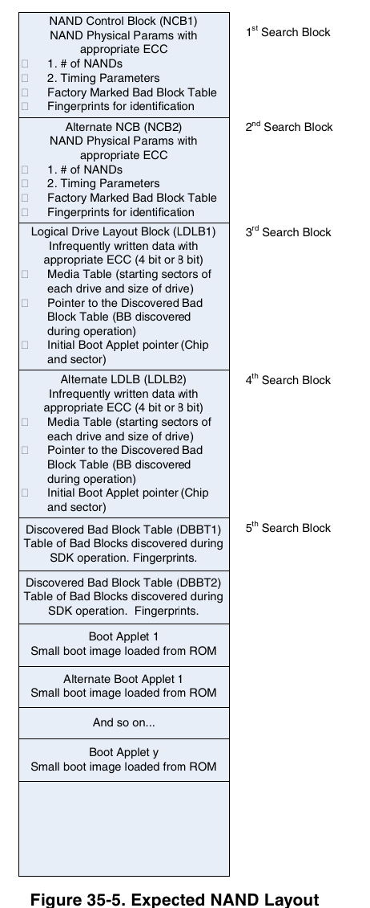
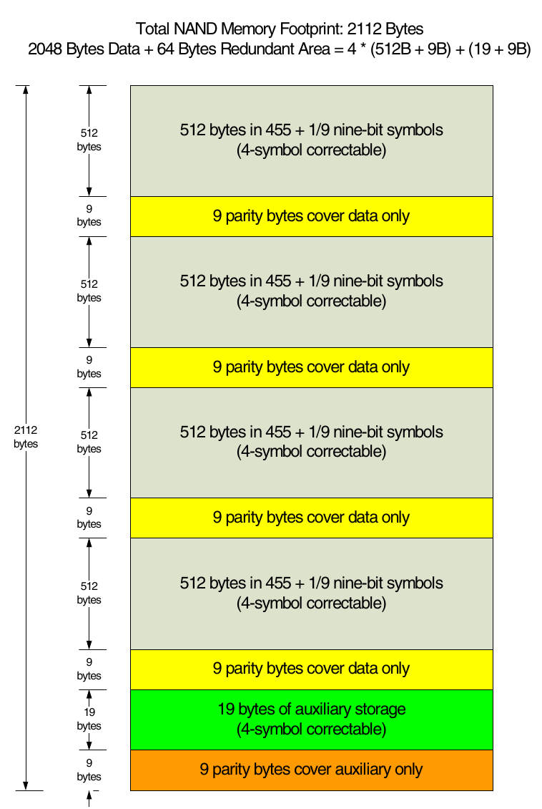
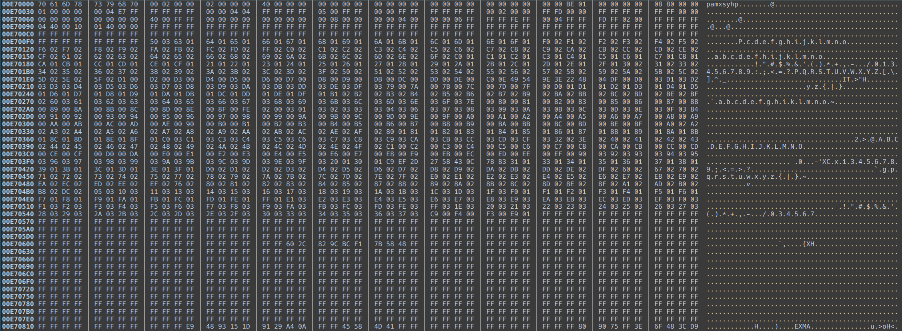
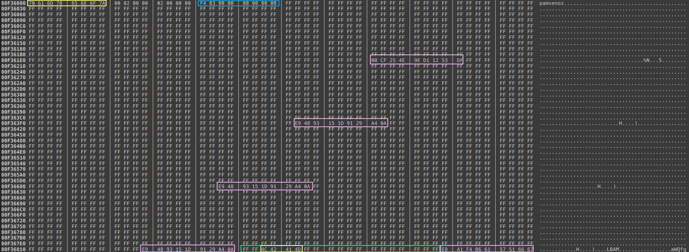
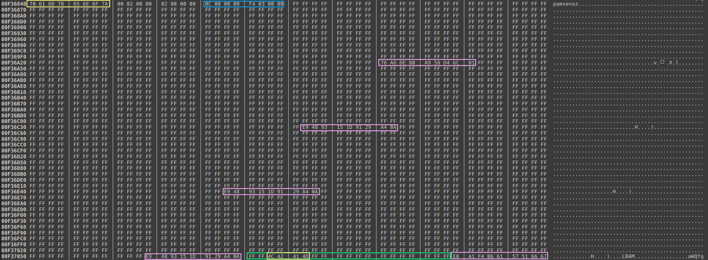
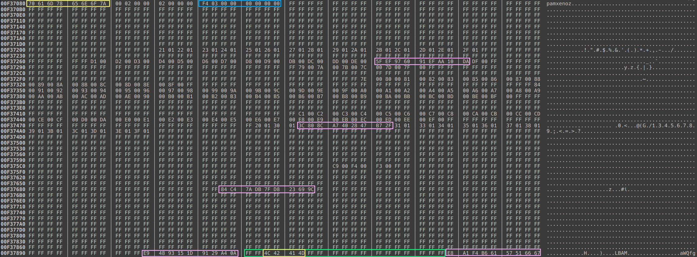
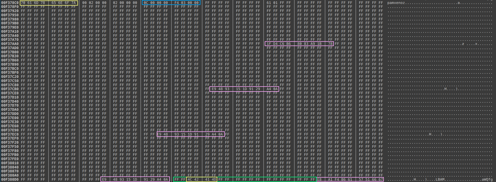
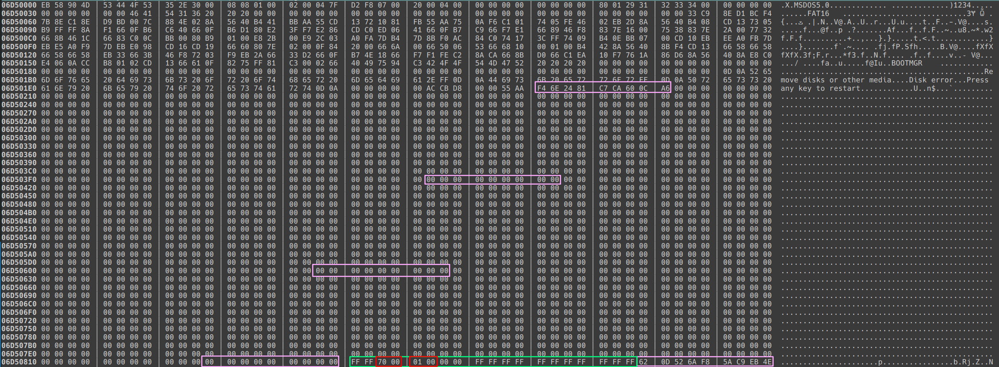
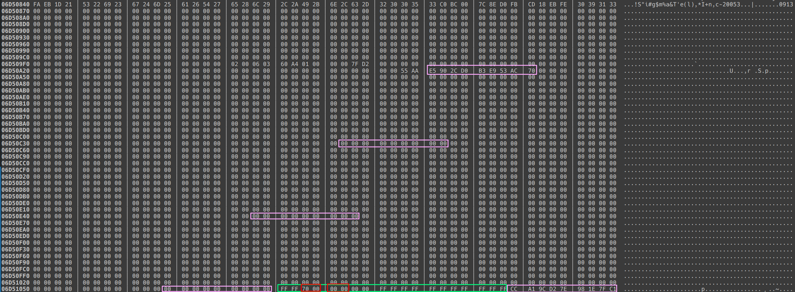

 
# Flash dump information and tools
I was able to obtain a bare flash dump of two Playaways (1 and 2 Gbit) for further analysis. Thank you [lospheris](https://github.com/lanmarc77/playaway/issues/2).  
  
## Overall flash dump structure
The general structure of the STMP3770s flash content can be read out from the [datasheet](IMX23RM.pdf) in chapter 35.8.3. The following picture was taken from this chapter:  
  
  
There are 2 NCBs describing the specifics of the NAND chips (timing, structure), two LDLBs describing where the actual code (called Boot Applet) will start and two DBBTs holding information about discovered bad blocks of the NAND chip.  
After the DBBTs the code starts. These are secure boot signed packages using the zero key (so basically no useful encryption). They are created using the sbtools (part of this repo taken from the Rockbox project).  
Interesting for me was where and how the file system was stored.  
  
## File system area
The code which follows after the DBBTs is 3 times in the flash dump and all copies are identical and follow each other. I assume this implements some kind of OTA/rollback feature from the used SigmatelSDK. As the Playaways are not made for this kind of process they have never been upgraded and all 3 slots contain the same firmware version.  
The space after the last Boot Applet is used for the file system where the actual audio files are stored and what is visible via USB.  
The following information is based on reverse engineering is incomplete and might be partially incorrect. The found information was enough to extract a mountable file system image from the two Playaway flash dumps.  
  
The file system area has at least three sections:  

```
|             |
| end of last |
| Boot Applet |
 -------------
| physxmap    |
|             |
|             |
|             |
 -------------
| zonexmap    |
|             |
|             |
|             |
|             |
|             |
|             |
 -------------
| file system |
| data        |
|             |
|             |
|             |
|             |
|             |
|             |
|             |
|             |
|             |
|             |
 -------------
 End of flash
```
### Flash page layout
Before going deeper into the different sections the page layout of the flash dump must be understood.  
Probably all Playaways use NAND chips with a 2048byte page and a 64byte spare area. To work with the STMPs hardware error checking (ECC) the following page layout must be present in the chip (taken from the [datasheet](IMX23RM.pdf)):  

According to the NCB information the parity algorithm used by the Playaway is RS-4bit.  
The data is mostly inside the the 512byte wide page sections.  
The auxiliary storage plays a vital role for the type of the page and partly its order inside a 64 page wide block and is explained in detail in the following sub chapters.  
  
#### physxmap
It is unclear what this map actually maps. I assume it is used when multiple NANDs are installed in a system to map which LBA sectors are mapped on which NAND chip. The information of this map was not needed to extract the file system as the Playaways only have one NAND chip. The following picture shows the only one entry of this section:  
  

Note the obfuscation of the reversed string pamxsyhp -> physxmap. If this is deliberate or has something to do with the endianess or making sure this can be used as ID and would never be part of code to e.g. allow scanning through the chip stays unclear.  
Together with the following zonexmap section these are 576 pages long in the 1Gbit and in the 2Gbit NAND flash dump.  
  
#### zonexmap
This section holds the information to translate the LBA sectors requested/written to by the operating system to flash pages and implements some kind of wear leveling. The following 4 pictures show entry structures of this section:  
  
  
  
  
  
The yellow sections are identifier. For the first identifier we can also see the reversed letter order as for physxmap. The second identifier is part of the green auxiliary space. Pink are the ECC parity bytes.  
Interesting is the blue part. This part consists of 2 32bit long values. The first value represents the number of entries in this map (here 1012 and 12) while the second represents a map starting address (0 or 1012).  
Multiple maps are combined into one big map. The first two map pictures need to be combined to one map with in sum 1024 entries (1012+12) starting at map address 0 until 1023.  
All the other space within a map is used for the entries. Each entry is a 16bit value representing a block in the flash. One block is 64 pages wide. FFFFh represents that this block is "empty" and no data was stored in it meaning it was erased or never written to.  
Taking a look at the third picture and finding the first used block shows the value 2101h meaning block number 289. This corresponds to start page 289*64pagesPerBlock=4840. 4840 corresponds to address 4840*2112bytesPerPage=02541000h in a flash dump.  
The zonexmap section now contains multiple map entries as shown in the pictures. In this example always two maps are combined to create the full map. The 4 pictures show this full map for two points in time. The map starting address of the blue part determines in which order the maps need to be combined.  
This is due to the fact that wear leveling was implemented. If a block is changed the firmware will update the map and write it to the flash. If updates like this are always placing the map at the same flash position this position will wear off very fast. To avoid this instead the map is written to a new (higher) position. This will eventually fill the whole section with maps from which only the "last" is the most recent one. The most recent map can be obtained by simply scanning over the whole space until no map is detected anymore. I assume that if the map section is full all of it is erased and the most recent map is then placed on top of the section again.  
The following table which is also output by the tools shows a most recent full map of a flash dump:

```
 Entry   Block   Block   Block   Block   Block   Block   Block   Block   Block   Block
    0    65535   65535   65535   65535   65535   65535   65535   65535   65535   65535
   10    65535   65535   65535   65535   65535   65535   65535   65535   65535   65535
   20    65535   65535   65535   65535   65535   65535   65535   65535   65535   65535
   30    65535   65535   65535   65535   65535   65535   65535   65535   65535   65535
   40    65535   65535   65535   65535   65535   65535   65535   65535   65535   65535
   50    65535   65535   65535   65535   65535   65535   65535   65535   65535   65535
   60    65535   65535   65535   65535   65535   65535   65535   65535   65535   65535
   70    65535   65535   65535   65535   65535   65535   65535   65535   65535   65535
   80    65535   65535   65535   65535   65535   65535   65535   65535   65535   65535
   90    65535   65535   65535   65535   65535   65535   65535   65535   65535   65535
  100    65535   65535   65535   65535   65535   65535   65535   65535   65535   65535
  110    65535   65535     848     355     356     357     358     359     360     361
  120      362     363     364     365     366     367     752     753     754     755
  130      756     757     758     759     760     761     762     763     764     765
  140      767     704     705     706     707     708     709     710     711     712
  150      713     714     715     716     717     718     719     609     610     611
  160      612     613     614     616     617     618     619     620     621     622
  170      623     448     449     450     451     452     453     454     455     456
  180      458     459     460     461     462     463     289     290     291     292
  190      293     294     295     296     297     298     299     300     301     302
  200      303     560     561     563     564     565     566     567     568     569
  210      570     571     572     573     575     592     593     594     595     596
  220      597     598     599     600     601     602     603     604     605     606
  230      607     209     210     211     212     213     214     215     216     217
  240      219     220     221     222     223     976     977     978     979     980
  250      981     982     983     984     985     986     987     989     990     991
  260      121     122     123     124     125     127     464     465     466     467
  270      468     469     470     471     472     473     474     475     476     477
  280      478     479     689     690     691     692     693     694     695     697
  290      698     699     700     701     702     703     864     865     866     867
  300      868     869     870     871     872     873     875     876     877     878
  310      879     126     128     129     130     131     133     134     135     136
  320      137     138     139     140     141     142     143     766     768     769
  330      770     771     772     774     775     776     777     778     779     780
  340      781     782     783     132     145     146     147     148     149     150
  350      151     152     153     154     155     156     157     158     159     160
  360      161     162     164     165     166     167     168     169     170     171
  370      172     173     174     144     176     177     178     179     180     181
  380      182     183     184     185     186     187     188     189     190     191
  390      672     674     675     676     677     678     679     680     681     682
  400      683     684     686     687     384     385     386     387     388     389
  410      390     391     392     393     394     395     396     397     398     399
  420      960     961     963     964     965     966     967     968     969     970
  430      971     972     973     975     562     574     576     577     578     579
  440      580     581     582     583     584     585     586     587     588     589
  450      590     591     193     194     195     196     197     198     199     200
  460      202     203     204     205     206     207     208     218     224     225
  470      226     227     228     229     230     231     232     233     235     236
  480      237     238     239     912     914     915     916     917     918     919
  490      920     921     922     923     924     925     926     927     288     304
  500      305     307     308     309     310     311     312     313     315     316
  510      317     318     319     720     721     722     723     724     725     726
  520      727     728     729     730     731     733     734     735     608     615
  530      624     625     626     627     628     629     631     632     633     634
  540      635     636     637     638     639     736     737     738     739     740
  550      741     742     743     744     745     746     748     749     750     751
  560      630     640     641     642     643     644     645     647     648     649
  570      650     651     652     653     654     655     673     685     688     696
  580      732     773     784     785     787     788     789     790     791     792
  590      793     794     795     796     797     799     496     497     498     499
  600      500     501     502     503     504     505     506     507     508     509
  610      510     511     993     994     995     996     997     998     999    1000
  620     1001    1002    1003    1004    1005    1007    1008    1009    1010    1011
  630     1012    1013    1014    1015    1016    1017    1018    1019    1020    1021
  640     1022    1023     798     800     801     802     803     804     805     806
  650      807     808     809     810     811     812     813     814     815     816
  660      819     820     821     822     823     201     244     243     489   65535
  670    65535   65535   65535   65535   65535   65535   65535   65535   65535   65535
  680    65535   65535   65535   65535   65535   65535   65535   65535   65535   65535
  690    65535   65535   65535   65535   65535   65535   65535   65535   65535   65535
  700    65535   65535   65535   65535   65535   65535   65535   65535   65535   65535
  710    65535   65535   65535   65535   65535   65535   65535   65535   65535   65535
  720    65535   65535   65535   65535   65535   65535   65535   65535   65535   65535
  730    65535   65535   65535   65535   65535   65535   65535   65535   65535   65535
  740    65535   65535   65535   65535   65535   65535   65535   65535   65535   65535
  750    65535   65535   65535   65535   65535   65535   65535   65535   65535   65535
  760    65535   65535   65535   65535   65535   65535   65535   65535   65535   65535
  770    65535   65535   65535   65535   65535   65535   65535   65535   65535   65535
  780    65535   65535   65535   65535   65535   65535   65535   65535   65535   65535
  790    65535   65535   65535   65535   65535   65535   65535   65535   65535   65535
  800    65535   65535   65535   65535   65535   65535   65535   65535   65535   65535
  810    65535   65535   65535   65535   65535   65535   65535   65535   65535   65535
  820    65535   65535   65535   65535   65535   65535   65535   65535   65535   65535
  830    65535   65535   65535   65535   65535   65535   65535   65535   65535   65535
  840    65535   65535   65535   65535   65535   65535   65535   65535   65535   65535
  850    65535   65535   65535   65535   65535   65535   65535   65535   65535   65535
  860    65535   65535   65535   65535   65535   65535   65535   65535   65535   65535
  870    65535   65535   65535   65535   65535   65535   65535   65535   65535   65535
  880    65535   65535   65535   65535   65535   65535   65535   65535   65535   65535
  890    65535   65535   65535   65535   65535   65535   65535   65535   65535   65535
  900    65535   65535   65535   65535   65535   65535   65535   65535   65535   65535
  910    65535   65535   65535   65535   65535   65535   65535   65535   65535   65535
  920    65535   65535   65535   65535   65535   65535   65535   65535   65535   65535
  930    65535   65535   65535   65535   65535   65535   65535   65535   65535   65535
  940    65535   65535   65535   65535   65535   65535   65535   65535   65535   65535
  950    65535   65535   65535   65535   65535   65535   65535   65535   65535   65535
  960    65535   65535   65535   65535   65535   65535   65535   65535   65535   65535
  970    65535   65535   65535   65535   65535   65535   65535   65535   65535   65535
  980    65535   65535   65535   65535   65535   65535   65535   65535   65535   65535
  990    65535   65535   65535   65535   65535   65535   65535   65535   65535   65535
 1000    65535   65535   65535   65535   65535   65535   65535   65535   65535   65535
 1010    65535   65535   65535   65535   65535   65535     353   65535   65535   65535
 1020    65535   65535   65535   65535

```
The first entries are all marked as empty. In fact they are not because they belong to the flash areas before the file system as the map uses absolute addressed block numbers. The first non empty entry block (here 848) always corresponds to LBA sector 0. As one block contains 64 pages LBA sectors 0...63 are stored within that block. The next map entry in block 355 will contain the LBA sectors 64...127.  
Together with the previous physxmap section both are 576 pages long in both the 1Gbit and 2Gbit NAND flash dump. As at least the zonexmap grows inside the area space it is unclear what the individual size of the two sections are. Based on counting empty pages (all FFh) the 1Gbit flash dump was 384 pages away from the physxmap section while the 2Gbit flash dump was 192 pages away. It is likely that the physxmap section is smaller than the zonexmap section. The scripts of this repo use scanning to find the zonexmap entries and do not need a specific page address.  
  
#### file system data
As we now know how to get the most recent block map and get an LBA sector from it lets take a look at the actual block content. Lets use block 848 which corresponds to start LBA sector 0. Block 848 corresponds to address 06D50000h in the flash dump. The following first two pages can be found there:  
  
  
Again marked the already known page layout with the same colors as before.  
What now has changed is the meaning of the red part within the green (auxiliary data) part. The first red part seems to be a unique block number. The second red part determines the order of that page within the current block. So even if the first picture page is placed earlier within the flash it comes after the second picture page when accessing the file system via USB.  
The flash dumps only contained a few of these pages where the order within the block did not correspond with the order in the flash dump.  
It is also possible that pages within a block are empty. They then do not contain a unique block number. All values of such a page are FFh.  
  
## The tools
The following tools are small helpers to deal with Playaway flash dumps. They are pure Perl without any additional libraries and should work on any Linux (and maybe other OS). None of the scripts verifies the parity bits but assumes the flash dump has no errors.  
  
### extractFileSystem.pl
Extracts the file system of the flash dumps. It scans for the zonexmap area and creates a mountable image file. It also displays the block map and gives a lot of debugging output.  
  
### extractFromTo.pl
Extracts parts of the flash and removes the spare area. This can be used to extract e.g. only the Boot Applet code for further analysis.  
  